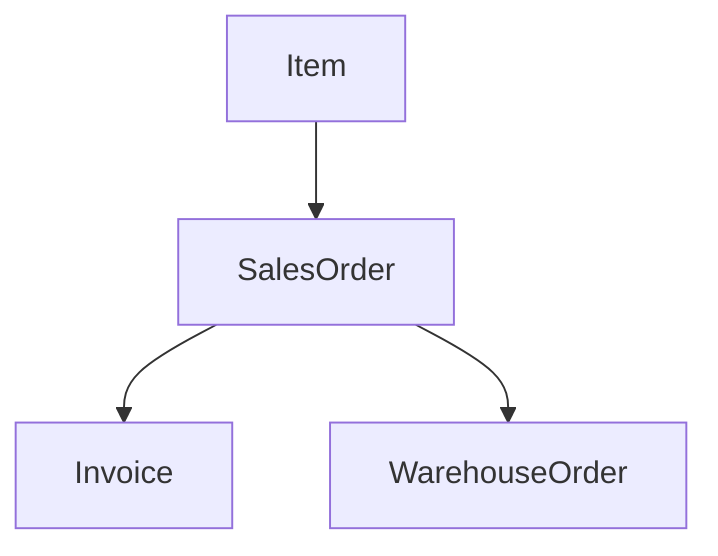

# About 
REDAG (Relational Data Generator) is a small python framework for generation of random data from relation model. 

For instance, consider a simplified model of Accounts Receivable data. 

A producer has a fixed portfolio of *Items*. Customer transaction request results in creation of a *SalesOrder* which corresponds to 
some quantity of an item from the portfolio. In the process of transaction some number of *Invoices* (which correspond to the sales order) is issued to the customer. 
Eventually ordered items are issued from the warehouse through *WarehouseOrder*. 

*Item*, *SalesOrder*, *Invoice*, *WarehouseOrder* are what we call entities. 
They are connected through directed acyclic relation graph:

An arrow indicates that there's a *OneToMany* relation between the source and the target. 

*Item* is what we call a dimension. Each dimension has a fixed maximal quantity and is always a source in the relation graph (i.e. has no parents).


Remaining entities are *facts* - entities which are unbounded in numbers and can have edges from any number of dimensions and at most one edge from fact. 

If you define the relation graph and recipe for generating entities, REDAG handles rest and samples entities from the model for you. 

Refer to example /example/accounts_receivable.py to see described model in action.

# Usage

## Defining entities and relations between entities 
Each entity is just an empty Python class with annotations defining its attributes. 
If entity should be a Fact, decorate it with *redag.fact* decorator, otherwise (entity is a dimension)
decorate it with *redag.dimension* and let the class derive from *redag.Dimension* class.

A fact definition looks like this:
```
@redag.fact()
class FactName
    attr1_name: attr1_type 
    .
    .
    .
    attrN_name: attrN_type
```
A dimension definition looks like this: 
```
@redag.dimension(max_quantity=K)
class DimensionName(Dimension)
    attr1_name: attr1_type 
    .
    .
    .
    attrN_name: attrN_type
```
Where *max_quantity=K* tells REDAG that it should generate at most *K* instances of the dimension. 

To define edges in the relation graph one must use attributes of special generic type *redag.Reference*.
For example in this model:
```
@redag.fact()
class Fact1Name:
    ...

@redag.fact()
class Fact2Name:
    fact1_id: redag.Reference[Fact1Name]

```

There's an edge going from entity *Fact1Name* to *Fact2Name* (i.e. to one *Fact1Name* corresponds multiple instances of *Fact2Name*).
References to dimensions are defined in the same manner.

## Generating entities 
REDAG provides two decorators:

    - *redag.multiplicity_generator_decorator*
    - *redag.generator_decorator*

The first one should decorate a method with signature *(cls, parents: Dict, \*\*kwargs) -> int*

and the latter with signature *(cls, parents: Dict, state: Dict, \*\*kwargs) -> Dict*

The first method decides how many entities should be generated by REDAG in one sample (e.q. how many Invoices correspond to one SalesOrder) - the result may be random.

The latter method should return dictionary mapping entity's attribute names to generated values. 
In case of both methods @parents is a dictionary mapping entity types to generated instances (restricted to entities preceding owner of the method in topological ordering of the relation graph).

State dictionary contains key *multiplicity* which keeps value from call to method generated by *redag.multiplicity_generator_decorator*. 

As the name suggest, state is passed through subsequent calls to *redag.generator_decorator* for the same entity and thus may be used to pass some information.

For instance in model 

*SalesOrder* -> *Invoice*

Many invoices may correspond to one SalesOrder. Total amount of all invoices must be equal to total amount on the SalesOrder. 
One can use State dict to achieve this. 
