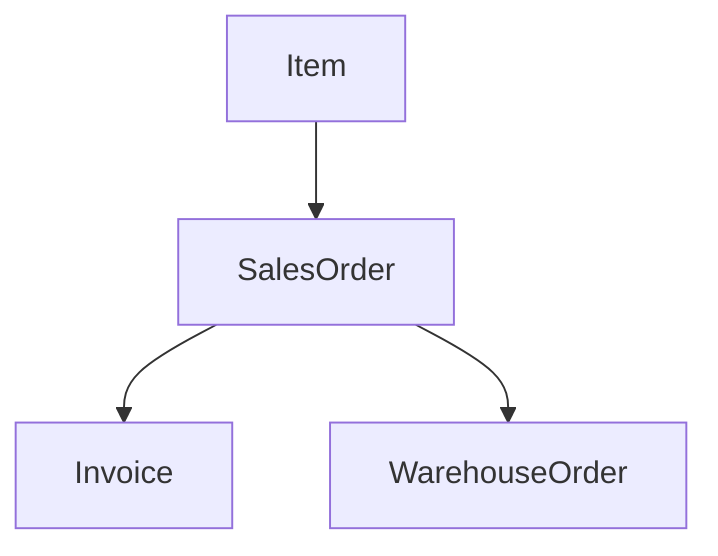

# About 
REDAG (Relational Data Generator) is a small python framework for generation of random data from relation model. 

For instance, consider a simplified model of Accounts Receivable data. 

A producer has a fixed portfolio of *Items*. Customer transaction request results in creation of a *SalesOrder* which corresponds to 
some quantity of an item from the portfolio. In the process of transaction some number of *Invoices* (which correspond to the sales order) is issued to the customer. 
Eventually ordered items are issued from the warehouse through *WarehouseOrder*. 

*Item*, *SalesOrder*, *Invoice*, *WarehouseOrder* are what we call entities. 
They are connected through directed acyclic relation graph:

An arrow indicates that there's a *OneToMany* relation between the source and the target. 

*Item* is what we call a dimension. Each dimension has a fixed maximal quantity and is always a source in the relation graph (i.e. has no parents).

Remaining entities are *facts* - entities which are unbounded in numbers and can have edges from any number of dimensions and at most one edge from fact. 

If you define the relation graph and recipe for generating entities, REDAG handles rest and samples entities from the model for you. 

Refer to example /example/accounts_receivable.py to see described model in action.

# Usage